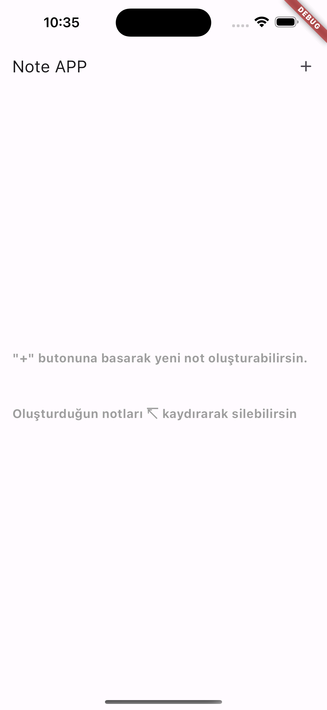

# Flutter NoteApp
**SQLite

You can create, edit and delete your notes. It's a note app.;

                      

## Getting Started

Firstly load packages;

     flutter pub get

## Debug on emulators

For emulator debug;

     flutter run

Then select Emulator.

## Debug on real device
For real device test. Connect with your phone. If android don't forget open developer mode.

     flutter run --release

## Debug on Web
Close flutter sdk WEB securities. Then run this code;

     flutter run -d chrome --web-renderer html --web-port 8080
